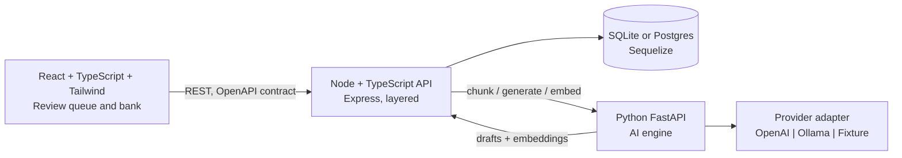
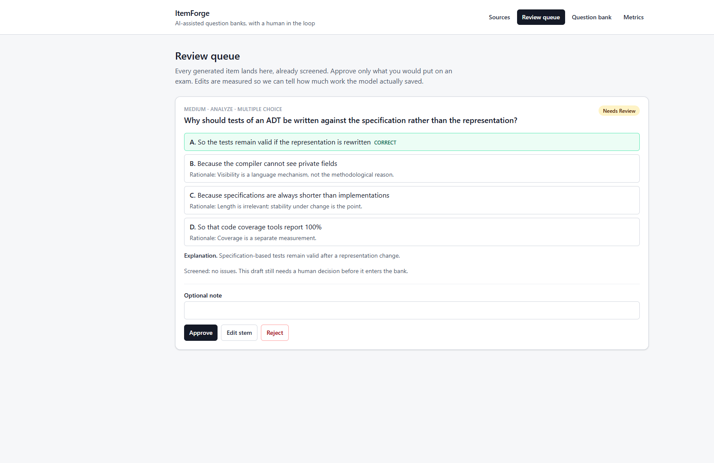
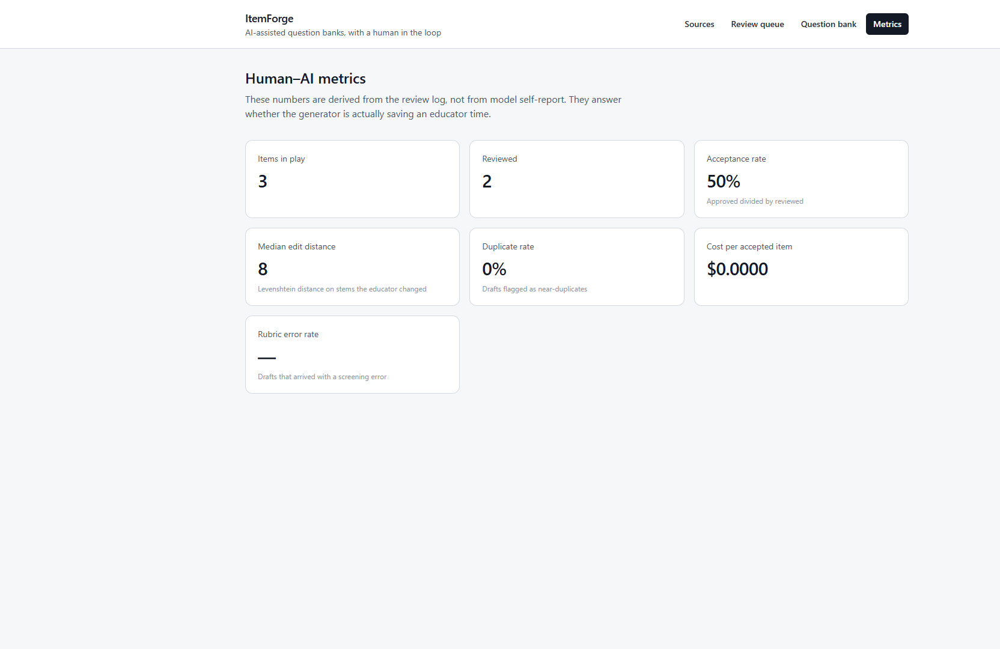

# ItemForge

An educator uploads course material. A Python AI service drafts assessment items. A **deterministic rubric** screens every draft before a human sees it. A review queue records every accept, edit, and reject, so the system can report whether the generator is actually saving anyone time.

Generation is table stakes. The screening, provenance, and measurement layer is the product.

This prototype was built as a portfolio piece for UBC CPSC 448 work on AI-powered question banks (Quesal). It is **not** Quesal — it is an independent exploration of the same problem: connecting an AI engine to an educator without letting unreviewed model output into an exam.

## Architecture



| Path | Role |
| --- | --- |
| [`apps/web`](apps/web) | Educator UI |
| [`apps/api`](apps/api) | HTTP API, screening, review, metrics, GIFT export |
| [`services/ai`](services/ai) | Chunking, generation, embeddings |
| [`docs/openapi.yaml`](docs/openapi.yaml) | The HTTP contract, written by hand |
| [`docs/DESIGN.md`](docs/DESIGN.md) | Why the system is shaped this way |

## Quick start (no Docker, no API key)

```bash
cp .env.example .env
npm install
python -m venv .venv
# Windows: .venv\Scripts\activate
# macOS/Linux: source .venv/bin/activate
pip install -r services/ai/requirements-dev.txt

npm run db:migrate
npm run db:seed

# terminal 1
npm run dev:api

# terminal 2
npm run dev:web

# terminal 3
cd services/ai && uvicorn app.main:app --reload --port 8000
```

Open [http://localhost:5173](http://localhost:5173). The fixture provider replays recorded CPSC 210 items, so a demo cannot be broken by a missing key or a rate limit.

Public repo: [github.com/bryl-dev/itemforge](https://github.com/bryl-dev/itemforge)





To use a real model, set `AI_PROVIDER=openai` and `OPENAI_API_KEY`, or `AI_PROVIDER=ollama` with a local daemon.

## What to click

1. **Sources** — a CPSC 210 excerpt is pre-filled. Save it, then **Draft questions**.
2. **Review queue** — every draft is already screened. Errors (catch-all options, verbatim stems, two correct answers) and warnings (length cues) sit on the card. Approve, edit, or reject.
3. **Question bank** — only approved items. Export Moodle GIFT.
4. **Metrics** — acceptance rate, median edit distance, duplicate rate, cost per accepted item. All derived from the review log, not from the model.

## Design constraints this repo takes seriously

- **The model never writes the bank.** Generated items enter `needs_review`. Approved is a human state.
- **The rubric does not call a model.** It is unit-tested, cheap, and stable across providers.
- **Provenance is a table**, not a log line. Every question points at the `generation_runs` row that produced it (model, prompt version, tokens, cost, latency).
- **Similarity is an interface.** The default implementation does cosine search over stored embeddings so SQLite and Postgres behave the same. A pgvector implementation exists for when a production model (and therefore a dimension) is frozen.
- **Null rates, not zeros.** An empty bank reports `acceptanceRate: null`, so a blank slate is not confused with "the AI helped 0% of the time".

## API (selected)

| Method | Path | Purpose |
| --- | --- | --- |
| `POST` | `/api/sources` | Upload source text |
| `POST` | `/api/sources/{id}/generate` | Draft + screen items |
| `GET` | `/api/questions?status=needs_review` | Review queue |
| `POST` | `/api/questions/{id}/approve` | Accept into the bank |
| `GET` | `/api/metrics` | Human–AI metrics |
| `GET` | `/api/export/gift` | Moodle GIFT of approved items |

Full contract: [`docs/openapi.yaml`](docs/openapi.yaml).

## Tests

```bash
npm test                         # API (Vitest)
cd services/ai && pytest -q      # AI engine
```

CI runs typecheck, API tests, web build, and pytest on every push ([`.github/workflows/ci.yml`](.github/workflows/ci.yml)).

## Deploy

Docker Compose is in [`docker-compose.yml`](docker-compose.yml) (Postgres + pgvector, API, AI engine, nginx UI). Platform notes are in [`docs/DEPLOY.md`](docs/DEPLOY.md).
